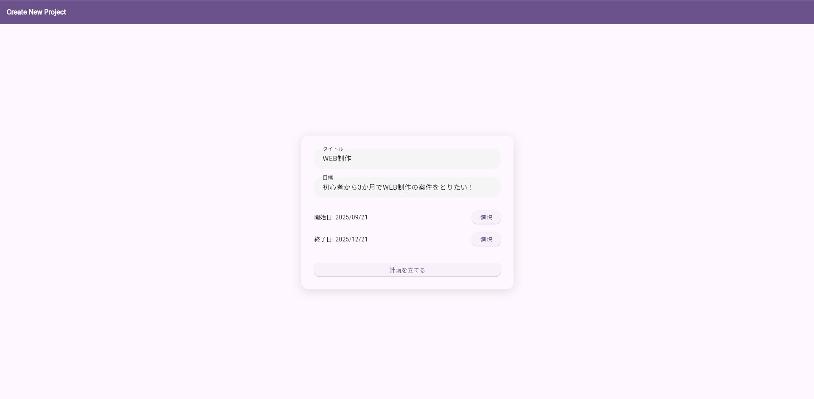
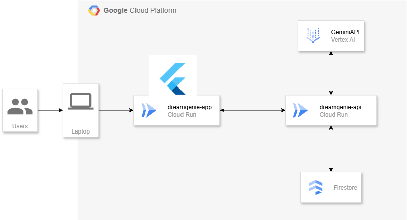

# 🧠 はじめに：AIが「夢の設計士」になる時代へ

「やりたいことはある。でも、どう進めればいいか分からない」  
そんな声に、AIがそっと寄り添う時代が来ました。**DreamGenie**は、ユーザーが目標と期間を入力するだけで、達成までの道筋を自動で設計してくれるAIアシスタントです。さらに、「予定を変更したい」と伝えるだけで、AIがあなたの予定を再構築してくれる。

---

# 🔍 背景・課題・ユーザー像

## 背景
- 多くの人が「目標設定」まではできても、「実行計画」に落とし込むのが難しい
- 予定変更があるたびに、手動でスケジュールを組み直すのは面倒
- タスク管理ツールは多いが、柔軟な再計画や自然言語対応はまだ不十分

## 課題
- 計画立案の心理的ハードル
- 予定変更時の再調整コスト
- 継続的なモチベーション維持

## 想定ユーザー
- 学生や社会人など、目標達成に向けて自律的に動きたい人
- 習慣化やスキルアップを目指す人
- タスク管理が苦手な人

---

# 📱 アプリについて：DreamGenieとは？

DreamGenieは、目標達成のための「計画生成」と「柔軟な再調整」をAIが担う、クラウドネイティブなWebアプリです。ユーザーは「目標」と「期限」を入力するだけで、AIが自動的にステップを分解し、日々の予定に落とし込んでくれます。

さらに、自然言語で「来週は忙しいから調整して」と伝えるだけで、AIが全体のスケジュールを再構成。ユーザーは計画に振り回されることなく、目標に集中できます。

---

# ⚙️ 主な機能

| 機能名 | 説明 |
|--------|------|
| 🎯 目標ベースの計画生成 | 目標と期限を入力するだけで、達成までのステップを自動設計 |
| 🗓️ スケジュール自動生成 | 日々の予定に落とし込んだToDoリストを提示 |
| 🗣️ 自然言語による再調整 | 「予定を変更したい」と話しかけるだけで、AIが再構成 |

- タイトル、目標、期間を入力

- Create Pageの入力情報をもとにガントチャートが自動で作成される
- AIとチャット形式でやり取りで計画の変更ができる

---

# 🏗️ アーキテクチャ

DreamGenieは、フロントエンドにFlutter Webを採用し、バックエンドはGCP Cloud Run上にFastAPI (Python)で構築されています。Dockerによるコンテナ化でスケーラブルな運用を実現しています。AIとの連携にはGemini APIを活用し、ユーザーの目標達成をサポートするタスクを生成・更新します。

## 技術スタック
- **フロントエンド**:Flutter Web
- **バックエンド**：FastAPI (Python)
- **ホスティング**：GCP Cloud Run, Docker
- **AI連携**：Gemini API
- **CI/CD**：GitHub Actions, Artifact Registry
- **認証**：Firebase Authentication（予定）

---

# 🗄️ データベース設計

- Firestore（NoSQL）を採用し、ユーザーごとの目標・計画・進捗を柔軟に管理
- スケジュールは「プロジェクトID」「ユーザーID」「日付」「タスク内容」「タイトル」「目標」で構成

---

# 🚀 拡張性と今後の展望

DreamGenieは、以下のような拡張性を持っています：

- 📱 モバイル対応：Flutter Webによるクロスプラットフォーム展開
- 🧠 パーソナライズ：ユーザーの過去の行動から計画精度を向上
- 🗣️ 音声入力対応：Speech-to-Text APIによる対話型操作
- 🔄 継続的なリマインド | モチベーション維持のための定期的な通知やフィードバック |
- 📊 進捗トラッキング | 達成率や残タスクを可視化し、振り返りをサポート |
- 🤝 **パーソナルコーチング機能**：AIとの対話を通じ、課題解決やモチベーション維持を支援
- 📝 **タスクの具体化**：抽象的なタスクを、実行可能なサブタスクへAIが分解
- 📈 **進捗に合わせた計画最適化**：進捗状況をAIが分析し、動的に計画を提案・修正

将来的には、「目標達成支援AI」として、教育・キャリア・健康など多様な領域への応用も期待されています。

---

# 🪄 おわりに：AIと夢を描く

DreamGenieは、ただのスケジュール管理ツールではありません。  
それは、あなたの「夢」に寄り添い、共に歩むAIです。  
「やりたいこと」を「できること」に変える──その一歩を、DreamGenieと踏み出してみませんか？